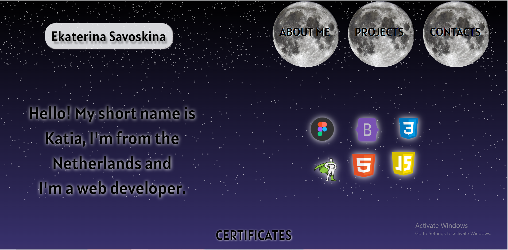

# Ekaterina Savoskina - Portfolio

Welcome to my GitHub repository showcasing my personal portfolio website.

## About

This repository contains the source code for my personal portfolio website. The website serves as a showcase of my web development skills, projects, and contact information. It was built using HTML, CSS, JavaScript, and various libraries and tools, including Bootstrap and GSAP animation.

## Table of Contents

- [About](#about)
- [Website Preview](#website-preview)
- [Projects](#projects)
- [Certificates](#certificates)
- [Contact](#contact)
- [Usage](#usage)
- [Contributing](#contributing)
- [License](#license)

## Projects

Explore my web development projects on the "Projects" page of the website. Each project includes a brief description, a mockup image, and a link to the live project or source code.

## Certificates

Check out my certificates and achievements on the "Certificates" page. I have completed various courses and received certifications in web development.

## Contact

You can reach out to me using the contact form on the "Contact" page of the website. Alternatively, you can contact me directly via phone or email.

## Usage

Feel free to use this repository as a reference for building your own personal portfolio website or for inspiration in your web development projects.

## Contributing

If you'd like to contribute or make suggestions to improve this repository or the website, please open an issue or submit a pull request. Your feedback and contributions are greatly appreciated.

---

Created with ❤️ by [Ekaterina Savoskina](https://github.com/YourGitHubUsername)
